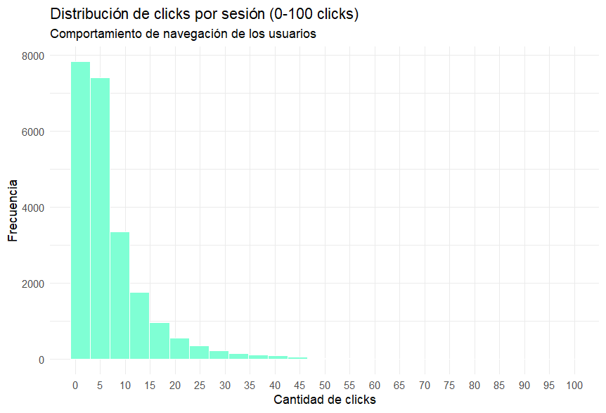
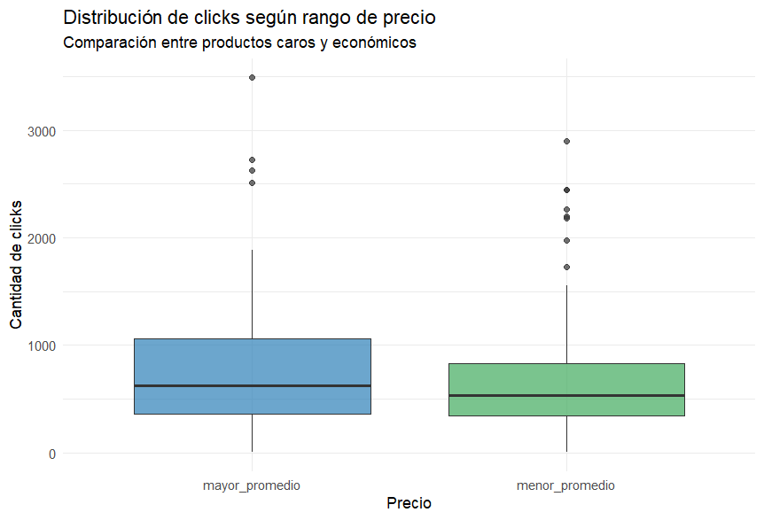
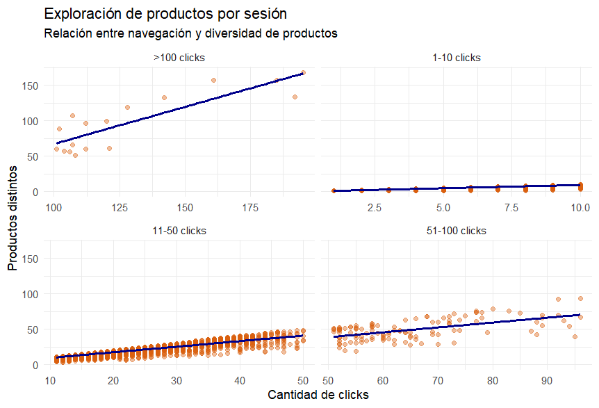
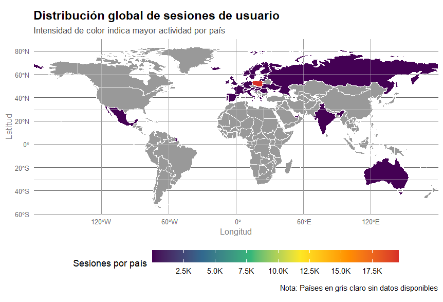
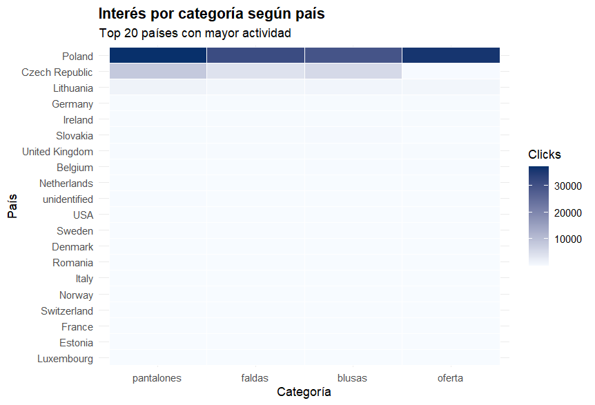
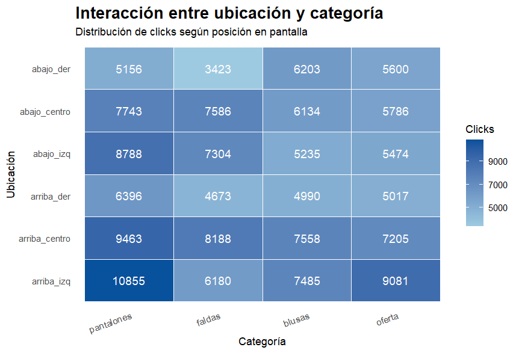

# Introducción

En la actualidad, las plataformas de comercio electrónico generan grandes volúmenes de datos relacionados con la navegación e interacción de los usuarios. El análisis de estos datos permite comprender patrones de comportamiento, preferencias de consumo y recorridos de exploración dentro de una tienda online.

La minería de datos aplicada al comercio electrónico permite identificar relaciones entre productos, descubrir patrones frecuentes de navegación y generar conocimiento útil para estrategias de marketing, sistemas de recomendación y técnicas de cross-selling.

En el presente trabajo se analizará un conjunto de datos perteneciente a una tienda online de ropa correspondiente al año 2008. A partir de técnicas de análisis exploratorio, visualización de datos, minería de itemsets frecuentes, reglas de asociación y análisis secuencial, se buscará comprender cómo interactúan los usuarios con los productos y categorías del sitio web.

Además, se estudiarán diferencias de comportamiento entre distintos países y se analizará la influencia de variables como ubicación visual, categoría y rango de precio en la exploración de productos.

# Objetivos

## Objetivo general

Descubrir patrones de comportamiento de navegación dentro de una tienda online de ropa con el fin de generar conocimiento útil para sistemas de recomendación, estrategias de cross-selling y análisis de comportamiento de usuarios.

## Objetivos específicos

1.  Identificar productos que suelen visualizarse conjuntamente

2.  Detectar combinaciones de productos relevantes para campañas de cross-selling

3.  Comparar hábitos de navegación entre países

4.  Encontrar secuencias típicas de exploración de productos

5.  Generar conocimiento para sistemas de recomendación

## Origen y características

El dataset proviene del repositorio UCI y contiene información de navegación de una tienda online polaca de ropa para embarazadas durante 5 meses del año 2008.

| Característica       | Valor               |
|:---------------------|:--------------------|
| Período              | Abril - Agosto 2008 |
| Registros totales    | 161523              |
| Sesiones únicas      | 23096               |
| Productos distintos  | 217                 |
| Países representados | 42                  |

# Exploración y preparación de datos

## Limpieza Inicial

**\
Decisiones de limpieza:**

- Se eliminó la variable `year` porque todos los registros son de 2008.

- Se filtraron los códigos de dominio de red 43 al 47 de la variable `country ya que no representan a ningun país.`

- Se transformaron variables numéricas a factores a etiquetas descriptivas.

- La etiqueta del id de session la pasamos de tipo numérico a factor para implementar de manera efectiva los algoritmos correspondientes.

## Estadísticas descriptivas

| Estadístico | Clicks por sesión | Precio (USD) |
|:------------|:------------------|:-------------|
| Mínimo      | 1                 | 18           |
| Mediana     | 6                 | 43           |
| Media       | 9.9               | 43.8         |
| Máximo      | 195               | 82           |

**Observación clave:** La distribución de clicks por sesión está fuertemente sesgada a la derecha (media 9.9, mediana 6), indicando que la mayoría de los usuarios realizan navegaciones cortas, mientras que una minoría explora extensivamente.

# Análisis gráfico 

## Distribución de clicks por sesión

El histograma permite analizar la intensidad de navegación de los usuarios dentro del ecommerce, considerando la cantidad de clicks realizados en cada sesión.

Se observa una distribución fuertemente asimétrica hacia la derecha, donde la mayoría de las sesiones presentan pocos clicks, mientras que un número reducido de usuarios realiza exploraciones mucho más extensas.

En particular:

- aproximadamente el 75% de las sesiones registran entre 1 y 12 clicks, lo que cual coincide con lo hayado en el análisis estadístico.

- A medida que aumenta la cantidad de clicks, la frecuencia de sesiones disminuye.



## Análisis de precio

El análisis de los diagramas de caja indica que los productos con un precio superior al promedio presentan un volumen de clics ligeramente mayor y una dispersión más amplia en sus interacciones. Por el contrario, los artículos más económicos muestran interacciones más bajas y concentradas, aunque ambos grupos registran valores atípicos significativos que logran superar los 2500 clics.



## Relación entre la navegación y diversidad de productos

Se observa una relación positiva entre la cantidad de clicks realizados en una sesión y la cantidad de productos distintos explorados. A medida que aumenta la cantidad de clicks, los usuarios tienden a visualizar una mayor diversidad de productos. Segmentamos por cantidad de clicks ya que al querer graficarlos en un mismo gráfico dificultaba la visualizacion de la información.



## Mapa de tráfico global

La mayor parte del tráfico se concentra en Europa, con Polonia, República Checa y Alemania como los principales países de origen. Polonia es el mercado principal con 17,000 sesiones, mientras que el resto de paises suele tener alrededor de 2500 sesiones.



## Comparativa de categoría de preda por país

Filtramos para ver los 20 paises con mayor cantidad de clicks para facilitar la visualización del gráfico.

Polonia presentó niveles de interacción considerablemente superiores al resto de los mercados, lo que lo posiciona como el principal origen de navegación del ecommerce. Además, las catagorías pantalones y ofertas mostraron mayor interacción en dicho país, contando con más de 30.000 clicks.



## Comparativa de categoría de prenda por localización

El análisis de las interacciones revela que la arquitectura espacial de la interfaz condiciona el tráfico de usuarios, concentrando la atención en el cuadrante superior izquierdo. Donde la categoría pantalones alcanza un pico de 10855 clicks, y perdiendo retención progresivamente hasta el extremo opuesto, con un mínimo de 3.423 clicks para faldas, lo que demuestra empíricamente la necesidad estratégica de reservar los bloques superiores de la pantalla para el inventario de mayor prioridad comercial. 




Para esta parte del análisis, comparamos cómo se comportan los usuarios de Polonia... (aquí va tu texto redactado). Los detalles exactos de los modelos y los porcentajes de las reglas que encontramos se pueden observar en la tabla adjunta:

```{r tabla-polonia, echo=FALSE, message=FALSE, warning=FALSE}
# Convertimos las reglas que ya tenés guardadas en el script a dataframe
tabla_polonia <- as(reglas_polonia_top10, "data.frame")

# Generamos la tabla con kable
knitr::kable(tabla_polonia, 
             digits = 3, 
             caption = "Top 10 Reglas de Asociación: Polonia (Categoría Blusas)", 
             row.names = FALSE)
