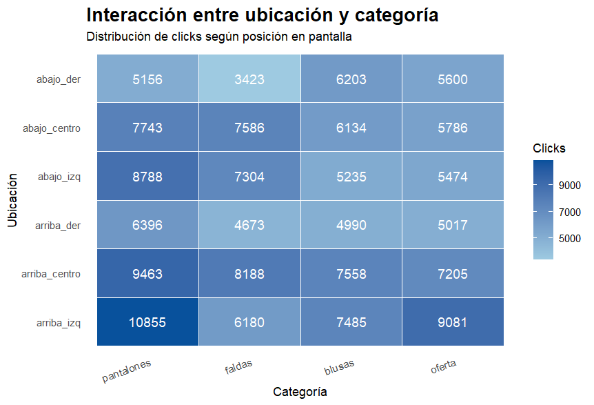
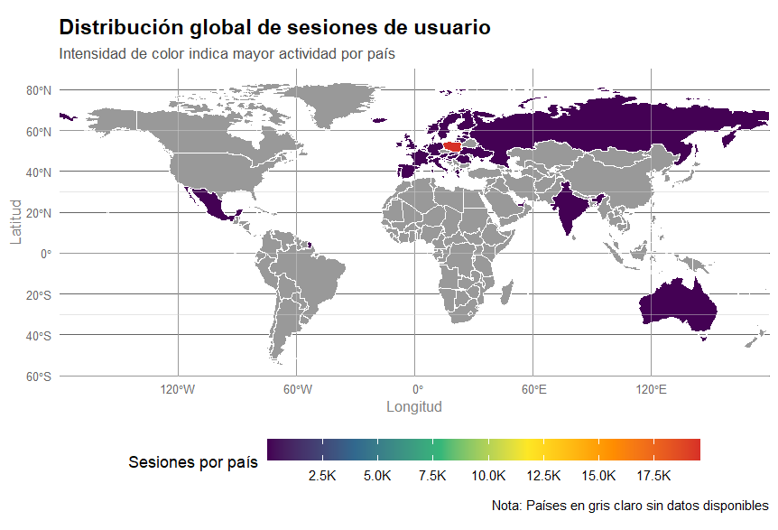

# 🛍️  Análisis de comportamiento de usuarios en e-commerce  

## Trabajo Práctico Final — Minería de Datos primer cuatrimestre 2026
## Autores: Camila Durand · Mateo Troncoso

Análisis del clickstream de una tienda online de ropa durante el periodo abril-agosto del 2008 para descubrir patrones de navegación útiles para sistemas de recomendación y estrategias de cross-selling. Se aplican análisis exploratorio, visualización, itemsets frecuentes usando Apriori y ECLAT, reglas de asociación y minería de secuencias con cSPADE.

📄 Informe completo: [Iforme-de-tabajo-practico-final.pdf](https://github.com/Camila20197/TP-Mineria-de-Datos-e-shop-clothing/blob/main/TPFinal_MD_2026.pdf)

## 🎯 Objetivos
Identificar productos que suelen visualizarse conjuntamente.
Detectar combinaciones de productos relevantes para campañas de cross-selling.
Comparar hábitos de navegación entre países.
Encontrar secuencias típicas de exploración de productos.
Generar conocimiento para sistemas de recomendación.

## 📊 Dataset

Clickstream data for online shopping — UCI Machine Learning Repository. Datos de navegación de una tienda online polaca de ropa para embarazadas.

Característica	Valor
Período	Abril – Agosto 2008
Registros totales	161.523
Sesiones únicas	23.096
Productos distintos	217
Países representados	42

La descripción de las variables está en data/e-shop clothing 2008 data description.txt.

## 🔬 Metodología
### Etapa	Técnicas
* Limpieza y preparación	Eliminación de year, filtrado de códigos de dominio no asociados a países (43–47), conversión de variables a factores con etiquetas descriptivas
* Análisis exploratorio	Clicks por sesión, categorías y productos más vistos, precio vs. clicks, mapa de tráfico global, posición en pantalla, evolución mensual, diagrama Sankey de transiciones
* Itemsets frecuentes	Apriori y ECLAT (soporte mín. 2 %) en tres niveles: general (categoría), específico (categoría + modelo) y moda (categoría + color)
* Patrones secuenciales	cSPADE + inducción de reglas secuenciales
* Comparación por país	Reglas de asociación para la categoría blusas en Polonia vs. República Checa
  
## 💡 Principales hallazgos
* Navegación corta y asimétrica: ~75 % de las sesiones tienen entre 1 y 12 clicks (mediana 6, media 9,9).
* La ubicación importa: el cuadrante superior izquierdo concentra la atención (pico de 10.855 clicks en pantalones).
* Los usuarios arman outfits: {blusas, pantalones} es el itemset más frecuente (soporte 24,8 %).
* Colores neutros dominan: negro, azul y marrón son los más presentes; las blusas blancas se asocian con pantalones azules (8 %).
* "Oferta" es el destino final: tras explorar varias prendas, los usuarios terminan en ofertas (confianza > 75 %, lift ≈ 2).
* Estrategias por país: Polonia muestra una navegación dispersa (→ carruseles variados), mientras que República Checa es más predecible (→ cross-selling directo bajo la foto del producto).
<p align="center">   </p>

## ⚙️ Cómo reproducirlo
### Requisitos
* R (≥ 4.x)
* RStudio
* Quarto para renderizar el informe.

1. Clonar el repositorio:
```bash
   git clone https://github.com/Camila20197/TP-Mineria-de-Datos-e-shop-clothing.git
```
2. Abrir Trabajo Final.Rproj en RStudio.
3. Instalar los paquetes necesarios:
```r
   install.packages(c("knitr", "dplyr", "tidyverse", "skimr", "ggplot2", "sf",
                      "rnaturalearth", "networkD3", "arules", "arulesViz",
                      "arulesSequences", "scales"))
```
4. Ejecutar TP_Final_Durand_Troncoso.R.
5. (Opcional) Renderizar el informe:
```bash
   quarto render "Iforme de tabajo practico final.qmd"
```

## 📚 Referencia del dataset

Łapczyński, M. (2019). Clickstream data for online shopping [Dataset]. UCI Machine Learning Repository. https://doi.org/10.24432/C5QK7X

<sub>Trabajo realizado con fines académicos para la materia Minería de Datos.</sub>
